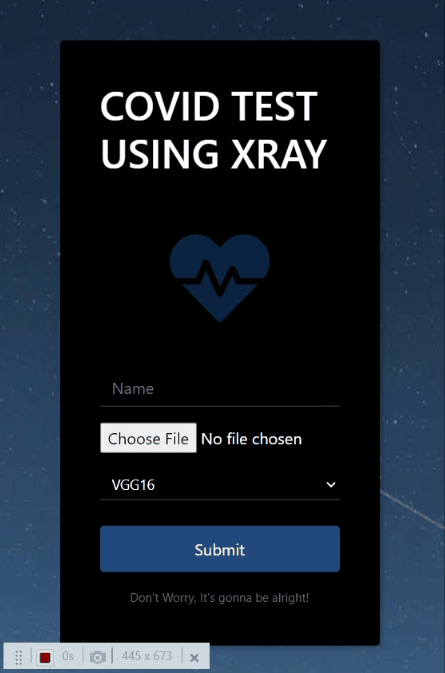

# COVID-DETECTION-USING-XRAY
> Tech Stack - <code></code><code></code>
<code></code>
<code></code>
<code></code>
<code></code>



<br>


- 	This app has mutiple models you can predict the xray upon, we trained a model on over 9 CNN models with different layers setup along with pretrained model like VGG16 and VGG19.
- 	OpenCV has been used to scale and resize the images to the required input size.
- 	Deployment has been done on flask with very basic route and 2 html pages.


## How to run?

OS X & Linux:

```sh
python app.py
```

Windows:

```sh
python app.py
```

## Usage

- This is an experimental project to better our understanding of the ImageProcessing using Neural Network.
- This obviously can't be deployed in real-time, because even if we have reached the accuracy of over 98% but the dataset used to train was not large and the metadata classified the Covid and Pneumonia cases as the same.

## Development setup

I have attached requirements.txt in the repository for better support, but majorly we the libraries involved are.

```sh
Flask 1.1.2
Keras 2.4.3
opencv-python 4.4.0.44
tensorflow 2.3.1
tensorboard 2.3.0
```

## EDA


## Meta

Priyanshu Chauhan –– priyanshuc.info@gmail.com

[https://github.com/Priyanshu-C/COVID-DETECTION-USING-XRAY](https://github.com/Priyanshu-C/COVID-DETECTION-USING-XRAY)


<!-- Markdown link & img dfn's -->
[npm-image]: https://img.shields.io/npm/v/datadog-metrics.svg?style=flat-square
[npm-url]: https://npmjs.org/package/datadog-metrics
[npm-downloads]: https://img.shields.io/npm/dm/datadog-metrics.svg?style=flat-square
[travis-image]: https://img.shields.io/travis/dbader/node-datadog-metrics/master.svg?style=flat-square
[travis-url]: https://travis-ci.org/dbader/node-datadog-metrics
[wiki]: https://github.com/yourname/yourproject/wiki
